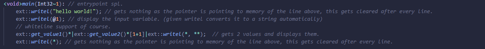

# Kaya.js

A fast and lightweight Spellscript interpreter written in pure JavaScript.

## Spellscript

  

_Spellscript_ is a procedural, library-dependent, interpreted programming language made by [JTnadrooi](). It's very lightweight and designed for simple linear tasks.

_From now on, I will use the "Can I code a spell interpreter in it?" benchmark to decide if I know a language or not._
